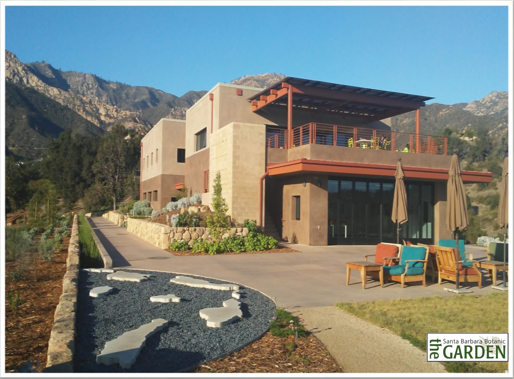

```{r setup, include=FALSE}
knitr::opts_chunk$set(echo = TRUE)
```

#### The Santa Barbara Botanic Garden

<br>

<p align="center"></p>


My path into conservation research began while working as a conservation technician in the Dept. of Conservation & Research at the Santa Barbara Botanic Garden (SBBG) with an explicit mission to conserve California’s native flora. My primary role was to help relocate the herbarium and intercalate two collections, and set up and run a new molecular biology laboratory that would leverage established and ongoing collections for biodiversity and conservation research. After establishing the lab, I focused on collecting and analyzing genetic and ecological data on rare, threatened, and endangered native plants. I also  managed volunteers, and I trained students from UC Santa Barbara and Santa Barbara City College in laboratory techniques.

My position at SBBG was foundational in preparing me to find real world solutions to the biodiversity and climate crises through biological research and helped me to build a network of fellow California botanists who share a passion for biodiversity. I am humbled to have contributed to projects with direct applications to conservation so early in my career, proving that science and natural history collections have the power to protect native species and support the conservation of entire natural ecosystems.


<p align="center"></p>
