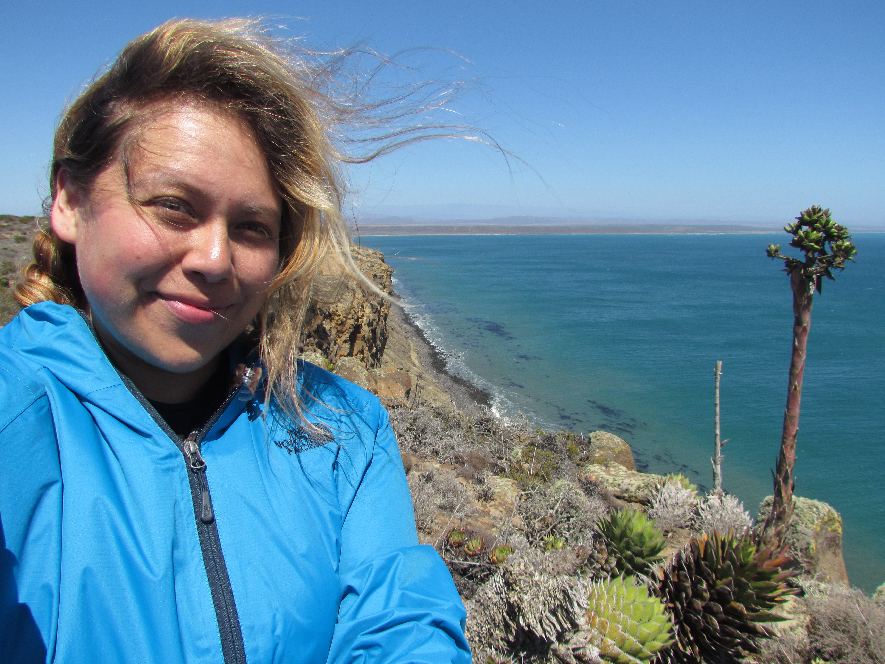

```{r setup, include=FALSE}
knitr::opts_chunk$set(echo = TRUE)
#rmarkdown::render_site()
```
<style>
H5{color:Green !important;}
</style>


<br>
 

## Adriana I. Hernández, PhD
### Postdoctoral Research Fellow, 
### California Academy of Sciences   


<br>


##### *About me, in brief*  

##### My passion for biodiversity studies and exploring natural history has driven me to a research career in plant evolutionary biology.  


#### **I am a population biologist who studies the evolution and ecology of California native plants. My work leverages natural history collections and comparative genomic and transcriptomic molecular techniques to inform our understanding of the patterns, processes, and mechanisms that drive and maintain biodiversity across the California landscape. These studies ultimately inform conservation action, and through citizen science and outreach projects, I also aim to diversify scholarship in the botanical sciences.** 

<br>
<br>

#### I work as a postdoctoral researcher with [Dr. Sarah Jacobs](https://www.sarahjjacobs.com/) in the Botany Dept. at the California Academy of Sciences, where I integrate molecular tools such as genomics and population genetics with morphological and ecological studies to inform species boundaries in Castilleja, the paintbrushes.


#### I received my Ph.D. in Plant Biology from Cornell University under the mentorship of [Dr. Chelsea Specht](https://blogs.cornell.edu/specht/). My dissertation research focused on characterizing and understanding the **population genetics and biogeography, comparative genomics and transcriptomics of floral trait evolution, and the ecological diversity of mariposa lilies, <i>Calochortus</i>** (Liliaceae).  


#### My other passion is creating space and support for historically marginalized communities in science and academia. As a first-generation immigrant and first-generation scholar, I recognize that my success is built upon the guidance of mentors. I strive to mentor and uplift historically marginalized students to pursue their goals in higher education and research. My efforts have ranged from volunteering as a tutor, to leading workshops, to developing and implementing pipeline programs for underserved youth.

<br>


###### PhD, Cornell University
###### NSF Graduate Research Program Fellow
###### Atkinson Center for Sustainability Research Fellow
###### Lewis and Clark Field Scholar
###### Edward A. Bouchet Graduate Honor Society Scholar
###### Yale Ciencia Academy Fellow

<br>

Carrizo Plain superbloom 2017

