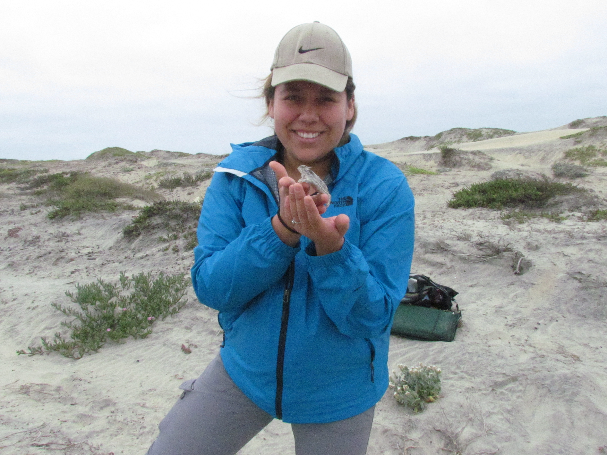
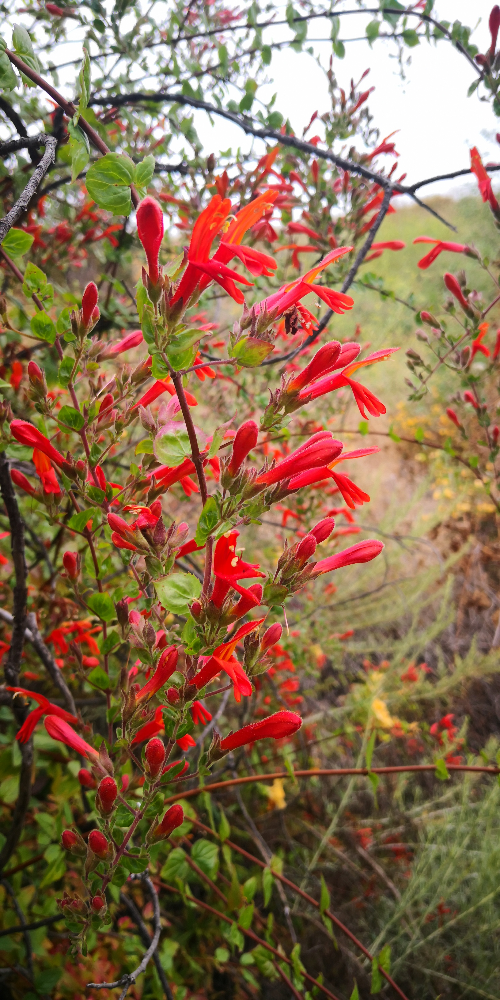

```{r setup, include=FALSE}
knitr::opts_chunk$set(echo = TRUE)
```

<br>

## About me, in brief

<br>

#### Welcome! This is my personal website

 

#### I am a 4th year Ph.D. Candidate in [Dr. Chelsea Specht's lab](https://blogs.cornell.edu/specht/) at Cornell University, School of Integrative Plant Science, Plant Biology Section. My dissertation research focuses on the population genetics, floral trait evolution, and ecological diversity of mariposa lilies, *Calochortus* (Liliaceae).

#### My other passion is creating space and support for historically marginalized communities in science and academia. As a first-generation immigrant and first-generation scholar, I recognize that my success is built upon the guidance of mentors. I strive to mentor and uplift historically marginalized students into higher education.

<br>

##### ...this site is under construction ...





