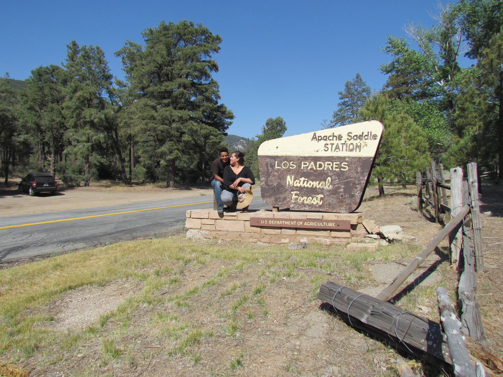

```{r setup, include=FALSE}
knitr::opts_chunk$set(echo = TRUE)
```
<br>

##### When I'm not hunting for plants throughout California, you can usually find me with my partner, Carlos, bicycling around the Cayuga Lake waterfront, doing yoga from home, experimenting with baking or my family's recipes for traditional Mexican cuisine, or discussing Native American religious traditions.

Carlos and me hunting for *Calochortus* at Mt. Pinos 




Carlos heading off for a cruise 


Some fun and tasty food we made

 

<br>

 ...*site under construction*...