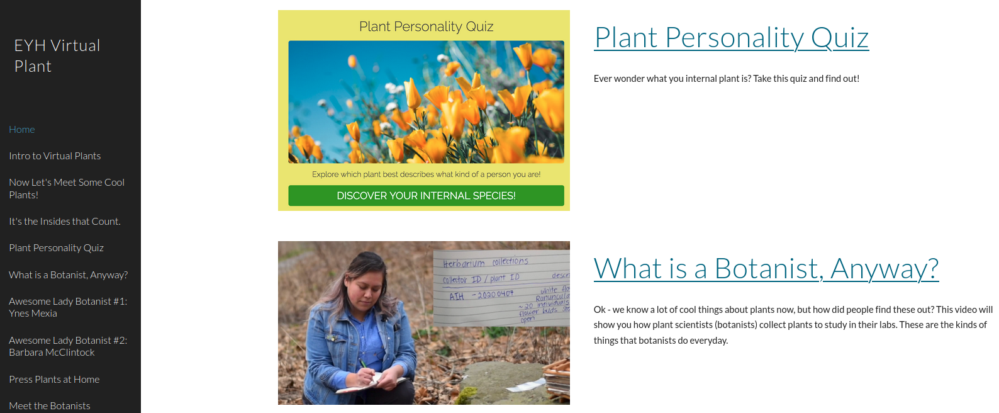

```{r setup, include=FALSE}
knitr::opts_chunk$set(echo = TRUE)
```

<br>

#### Through outreach and my personal experience, I have learned that for many first generation college students, support and understanding from their family is required for students to succeed. While many families provide moral support, understanding their student’s path through academia often never comes. Students thus rely on a community of peers and mentors to navigate challenges and tough decisions.

---

#### As a graduate student, I have focused my efforts on mentoring URM undergraduate students through research experiences, workshops, and graduate school recruitment. I have also developed opportunities for graduate students to build on their experiences in order to provide effective and tailored mentorship to their undergraduate mentees. Many of the mentorship and outreach projects I am involved in outside of the lab and field are held through the Graduate School at Cornell as a Graduate Student Ambassador. I also serve on diversity committees for the Botanical Society of America, the College of Agriculture and Life Science at Cornell, the School of Integrative Plant Science at Cornell.  


##### **Recruitment of historically excluded students into STEM graduate programs**  
SACNAS Cornell Chapter [(Society for Advancement of Chicanos/Hispanics and Native Americans in Science)](https://www.sacnas.org/) at the 2019 SACNAS National Diversity in STEM Conference. I was appointed as a Graduate Student Ambassador by the Graduate School at Cornell to recruit undergraduate students into our graduate programs.

  


I serve as a Co-leader and Mentorship Committee Chair for Cornell's Diversity Preview Weekend [(DPW)](http://www.cornelldpw.org/) which aims to provide a transparent perspective on applying to graduate school and being a successful student. I chair the Mentorship Committee which pairs DPW participants with Cornell graduate students to gain feedback on their application materials. We generate workshop material for graduate student mentors to learn how to effectively provide constructive feedback to prospective graduate students on their CVs and personal statements, as well as creating guidelines and providing resources for prospective students to follow as they draft their statements and CVs.    


##### **Mentoring prospective students through graduate student panels**  
Graduate student panels provide an opportunity for open communication and engagement between prospective and current graduate students. This is especially important for students from first-generation and non-traditional backgrounds to gain insights into the hidden curriculum. I have led and participated in numerous panels through the Cornell Graduate School and the SACNAS Cornell Chapter.

  
  
  

##### **I also greatly enjoy engaging children in building hypothesis, expanding their curiosity, and integrating art and science.**  
> For example, I worked with fellow graduate students at Cornell to develop a virtual plant workshop for [Expanding Your Horizons](https://www.eyh.cornell.edu/virtualEYH/activities.php), which is focuses on engaging girls in junior high to do science and see themselves as scientists. We created a website with a diversity of content on botany that can be accessed here: [Virtual Plant Workshop 2020](https://sites.google.com/cornell.edu/virtualplantworkshop/home?authuser=0)  

>

> For another year of [Expanding Your Horizons](https://www.eyh.cornell.edu/virtualEYH/activities.php), I helped run a workshop on cellular biology and microscopy through hands-on experiments in the classroom.  

>

<br>
