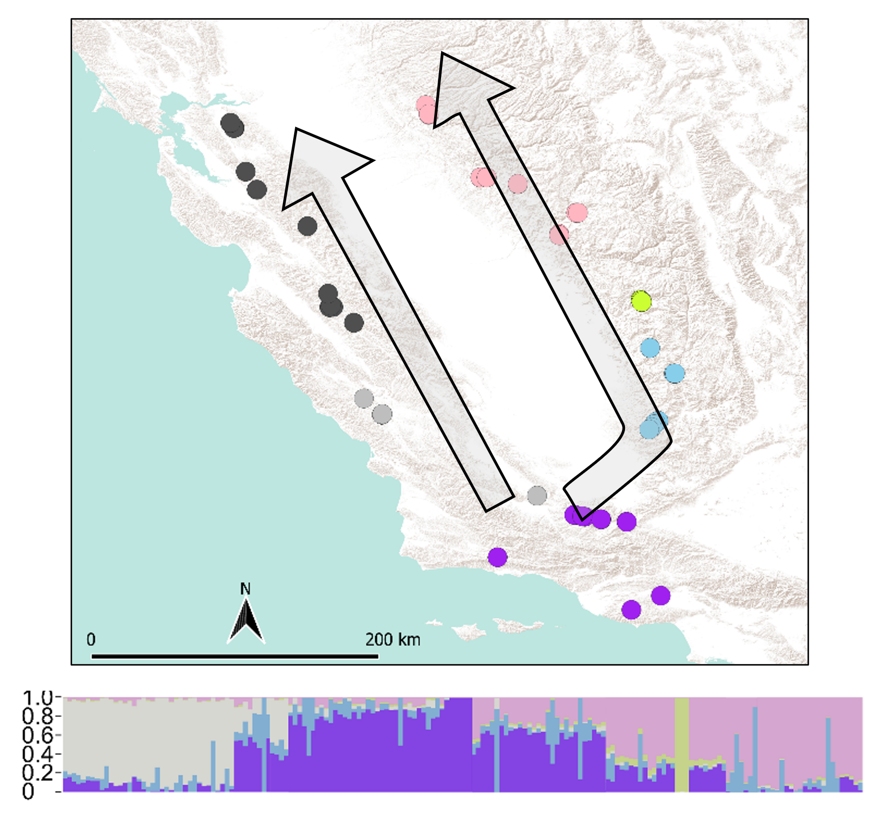
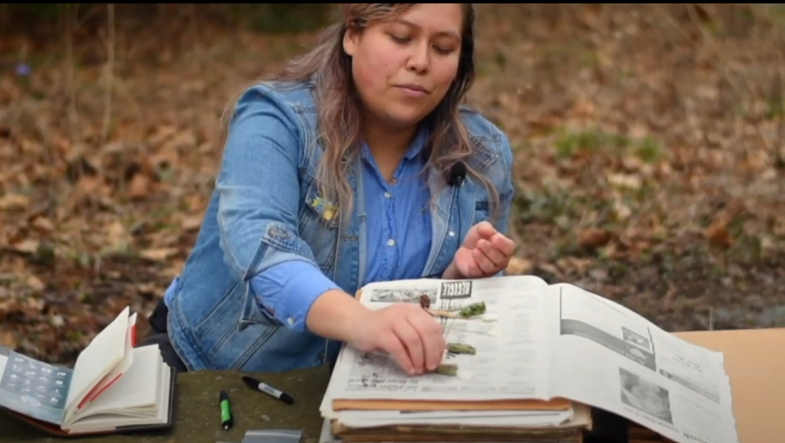

```{r setup, include=FALSE}
knitr::opts_chunk$set(echo = TRUE)
```

<br>


##### **Phylogeography and population genetics reveal ring species patterns in the highly polymorphic <i>Calochortus venustus</i> (Liliaceae)** 



> ##### My interest in biogeography led me to investigate how landscape and environmental heterogeneity shapes genetic and phenotypic diversity in this hyper-variable system. *Calochortus venustus* is an herbaceous California endemic bulb found in grasslands, woodlands, and at its highest elevations in pine forests surrounding the Central Valley of California. They are generally distributed throughout the Coast Ranges, Transverse Ranges and Tehapachi Mountains, and Sierra Nevada foothills. I used a population genetics approach using **RAD-Sequencing** to characterize the population dynamics and genetic diversity of this system which revealed that gene flow is shared across morphotypes (of various petal pigments and patterns), and that populations remain interconnected throughout mountain ranges surrounding the Central Valley. Phylogeographic methods were used to infer historical range expansion which suggest a south to north bidirectional history and subsequent **parallel evolution** in northern populations where almost all individuals have white flowers. This work adds to the few number of known **ring species**.
<font size="3">[Hernández, A. I., Landis, J. B., & Specht, C. D. (2022) Phylogeography and population genetics reveal ring species patterns in a highly polymorphic California lily. <i>Journal of Biogeography</i>. ](https://onlinelibrary.wiley.com/doi/abs/10.1111/jbi.14313) </font>
> <font size="3"> Please feel free to email me for a pdf of the article.</font>

<br clear="right"/>


##### **Putative adaptive loci show parallel clinal variation in a California‐endemic wildflower**


<figure>
  <figcaption> Alleles under climate selection track environmental differences between coastal and inland transects in <i>Calochortus venustus</i> </figcaption>
  
 </figure>


> ##### One of the central goals of evolutionary biology and ecology is to understand the process of adaptation to new environments, such as with range expansion. Results from our population genetics and phylogeography study provide evidence of gene flow between phenotypes and parallel evolution which provides an interesting opportunity to address questions about genetic signatures of selection in a system with multiple polymorphic floral traits. There is much to be investigated about whether repeated migration into similar habitats drives divergence or convergence of molecular evolution from global standing genetic variation. I identify genetic markers associated with each of nine climatic variables known to influence growth, phenology, and distribution of California’s Mediterranean climate-adapted plants, such as annual precipitation, mean annual temperature, and temperature seasonality. Despite gene flow between individuals of different floral phenotypes and between populations, **we find evidence of ecological specialization at the molecular level**, including genes associated with key plant functions linked to plant adaptation to California's Mediterranean climate. **SNPs present in both transects show similar trends in allelic similarity across latitudes indicating parallel adaptation to northern climates**. Comparisons between eastern and western populations across latitudes indicate divergent genetic evolution between transects, suggesting local adaptation to either coastal or inland habitats. Our study is among the first to show repeated allelic variation across climatic clines in a non-model organism.

<font size="3">[Hernández, A. I., & Specht, C. D. (2023) Putative adaptive loci show parallel clinal variation in a California‐endemic wildflower. <i>Molecular Ecology</i>. ](https://onlinelibrary.wiley.com/doi/abs/10.1111/mec.17029) </font>
> <font size="3"> Please feel free to email me for a pdf of the article.</font>


<br clear="left"/>


##### **Floral eco-evo-devo across floral syndromes in the genus *Calochortus* (Liliaceae)**
> ##### There are four floral syndromes in the genus with multiple independent derivations (see Patterson & Givnish 2004), leading us the question the **ecological function and genetic development of each floral syndrome**:
> + cat's ears (eg. [*C. tolmiei*](https://www.google.com/url?sa=t&rct=j&q=&esrc=s&source=web&cd=&cad=rja&uact=8&ved=2ahUKEwj0qsPXhfnsAhUcq3IEHVaUCAAQFjAAegQIAxAC&url=https%3A%2F%2Fwww.calflora.org%2Fcgi-bin%2Fspecies_query.cgi%3Fwhere-calrecnum%3D1310&usg=AOvVaw2ljvJ4tPu8KFphriY2gCku))
> + mariposas (eg. [*C. argillosus*](https://www.google.com/url?sa=t&rct=j&q=&esrc=s&source=web&cd=&cad=rja&uact=8&ved=2ahUKEwjP6MP9hvnsAhXlmHIEHezyCyIQFjAAegQIAxAC&url=https%3A%2F%2Fwww.calflora.org%2Fcgi-bin%2Fspecies_query.cgi%3Fwhere-calrecnum%3D1268&usg=AOvVaw1diuqnNmPb2NifdoTYlBuN))
> + fairy lanterns (eg. [*C. pulchellus*](https://www.google.com/url?sa=t&rct=j&q=&esrc=s&source=web&cd=&cad=rja&uact=8&ved=2ahUKEwiuwfbahvnsAhX2kHIEHYA3DUQQFjAAegQIBhAC&url=https%3A%2F%2Fwww.calflora.org%2Fcgi-bin%2Fspecies_query.cgi%3Fwhere-calrecnum%3D1303&usg=AOvVaw2QBlS14i0aU7FA141dy843))
> + star tulips (eg. [*C. umbellatus*](https://www.google.com/url?sa=t&rct=j&q=&esrc=s&source=web&cd=&cad=rja&uact=8&ved=2ahUKEwiqqqKUh_nsAhXtlnIEHRFBCHsQFjAAegQIBhAC&url=https%3A%2F%2Fwww.calflora.org%2Fcgi-bin%2Fspecies_query.cgi%3Fwhere-taxon%3DCalochortus%2Bumbellatus&usg=AOvVaw3GjaZMJSXjlN0XoH3Of28k))

> ##### We are utilizing an **RNA-Seq** approach to characterize gene expression and identify differentially expressed genes, or candidate genes, responsible for floral traits. We are also sequencing low coverage genomes to perform **genomic scans** for divergent selection between representative species from each floral syndrome.

<br>


##### **The vital role of natural history collections in biodiversity research and studies on <i>Calochortus</i>**  





> ##### My doctoral research leverages high-throughput sequencing techniques focused on the plant genus Calochortus due to its high species richness and floral diversity with a center of diversity in California, and yet it maintains cases of edaphic specialization, narrow endemism, and rarity. Calochortus had no existing genetic resources so I used herbarium records, iNaturalist, and knowledge from local amateur botanists and land managers to collect over 500 samples across ~35 species of Calochortus throughout California. I collected and preserved floral tissue for genetics and phenotyping, herbarium specimens and photographs to voucher each population, and bulbs to maintain a living collection and for growth chamber experiments. With the appropriate permits, my collections span national parks, national forests, state parks, UC reserves, and private properties. Vital to this work are natural history collections from herbaria such as through the centralized online database: [Consortium of California Herbaria (CCH)](https://www.cch2.org) from which I located populations for surveying and collecting. The utility and accessibility of nature phone apps such as [iNaturalist](https://www.inaturalist.org/) allow amateur botanists and naturalists and researchers alike to mark observations of plant and animal species without harming the specimen for collection, while still capturing morphological data through photo uploads, locality information through GPS coordinates, and habitat and phenological data specified by the observer. Some of my collections were sourced through observations marked on iNaturalist, many of which were not previously collected. With massive amounts of data from herbarium collections and iNaturalist, we can also track phenological changes to address pressing questions about the effect of global warming and climate change on species flowering and fruiting.


<br>


##### **I regularly present my work at national conferences, symposia for professional societies, and invited seminars.**


<p align="center"></p>


<br>
