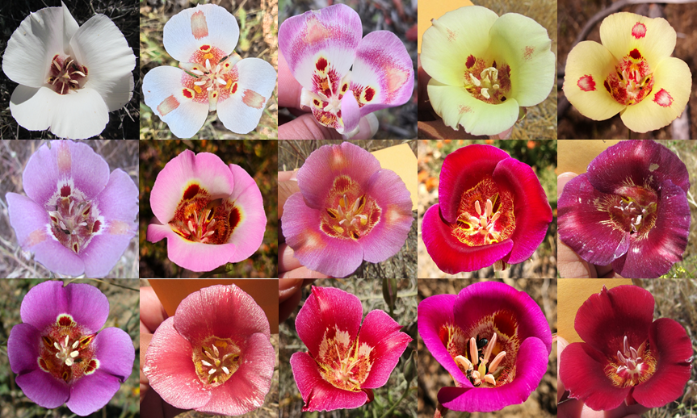

```{r setup, include=FALSE}
knitr::opts_chunk$set(echo = TRUE)
```


<br>

 ...site under construction...

##### The Population Dynamics and Evolutionary History of the Highly Polymorphic <i>Calochortus venustus</i> (Liliaceae)  
> ##### My interest in biogeography led me to investigate how landscape and environmental heterogeneity shapes genetic and phenotypic diversity in this hyper-variable system. *Calochortus venustus* is a California endemic found in grasslands, woodlands, and at its highest elevations in pine forests. They are generally distributed throughout the Coast Ranges, Transverse Ranges and Tehapachi Mountains, and Sierra Nevada foothills. A population genetics approach using RAD-Sequencing reveals gene flow is shared across morphotypes (petal pigmentation and patterning), and populations remain interconnected throughout mountain ranges surrounding the Central Valley.

##### Floral eco-evo-devo across floral syndromes in *Calochortus* (Liliaceae)
> ##### There are four floral syndromes in the genus leading us the question the ecological function and genetic development of each:
> + cat's ears (eg. [*C. tolmiei*](https://www.google.com/url?sa=t&rct=j&q=&esrc=s&source=web&cd=&cad=rja&uact=8&ved=2ahUKEwj0qsPXhfnsAhUcq3IEHVaUCAAQFjAAegQIAxAC&url=https%3A%2F%2Fwww.calflora.org%2Fcgi-bin%2Fspecies_query.cgi%3Fwhere-calrecnum%3D1310&usg=AOvVaw2ljvJ4tPu8KFphriY2gCku))
> + mariposas (eg. [*C. argillosus*](https://www.google.com/url?sa=t&rct=j&q=&esrc=s&source=web&cd=&cad=rja&uact=8&ved=2ahUKEwjP6MP9hvnsAhXlmHIEHezyCyIQFjAAegQIAxAC&url=https%3A%2F%2Fwww.calflora.org%2Fcgi-bin%2Fspecies_query.cgi%3Fwhere-calrecnum%3D1268&usg=AOvVaw1diuqnNmPb2NifdoTYlBuN))
> + fairy lanterns (eg. [*C. pulchellus*](https://www.google.com/url?sa=t&rct=j&q=&esrc=s&source=web&cd=&cad=rja&uact=8&ved=2ahUKEwiuwfbahvnsAhX2kHIEHYA3DUQQFjAAegQIBhAC&url=https%3A%2F%2Fwww.calflora.org%2Fcgi-bin%2Fspecies_query.cgi%3Fwhere-calrecnum%3D1303&usg=AOvVaw2QBlS14i0aU7FA141dy843))
> + star tulips (eg. [*C. umbellatus*](https://www.google.com/url?sa=t&rct=j&q=&esrc=s&source=web&cd=&cad=rja&uact=8&ved=2ahUKEwiqqqKUh_nsAhXtlnIEHRFBCHsQFjAAegQIBhAC&url=https%3A%2F%2Fwww.calflora.org%2Fcgi-bin%2Fspecies_query.cgi%3Fwhere-taxon%3DCalochortus%2Bumbellatus&usg=AOvVaw3GjaZMJSXjlN0XoH3Of28k))

##### Genotyping using microsatellites shows strong genetic differentiation among populations of the Channel Islands endemic Malva assurgentiflora, Malvaceae.

##### Using spatial phylogenetics to inform conservation at the archipelago-scale: an introduction to the Channel Islands Phylodiversity Project

<br>

A sample of the hyper-variable phenotypic diversity in *Calochortus venustus*
