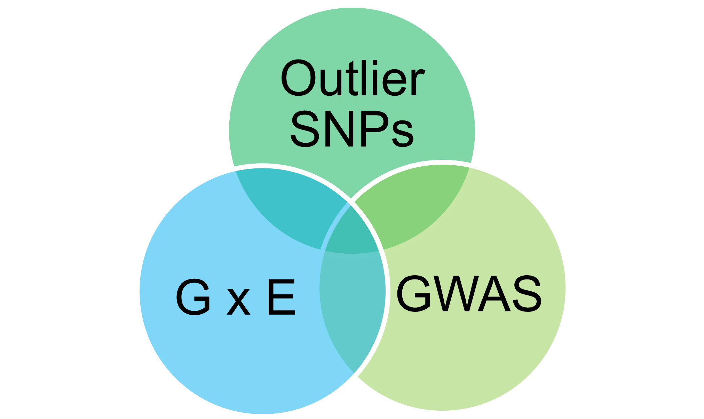
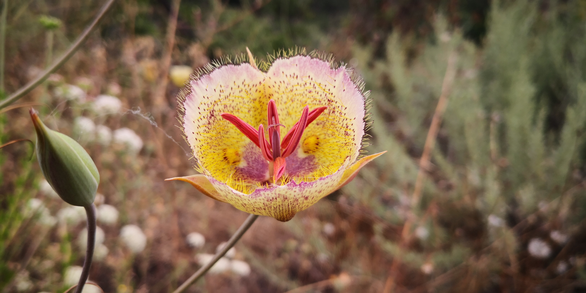

```{r setup, include=FALSE}
knitr::opts_chunk$set(echo = TRUE)
```

<br>


##### **The Population Dynamics and Evolutionary History of the Highly Polymorphic <i>Calochortus venustus</i> (Liliaceae)** 


> ##### My interest in biogeography led me to investigate how landscape and environmental heterogeneity shapes genetic and phenotypic diversity in this hyper-variable system. *Calochortus venustus* is an herbaceous California endemic bulb found in grasslands, woodlands, and at its highest elevations in pine forests surrounding the Central Valley of California. They are generally distributed throughout the Coast Ranges, Transverse Ranges and Tehapachi Mountains, and Sierra Nevada foothills. I used a population genetics approach using **RAD-Sequencing** to characterize the population dynamics and genetic diversity of this system which revealed that gene flow is shared across morphotypes (of various petal pigments and patterns), and that populations remain interconnected throughout mountain ranges surrounding the Central Valley. Phylogeographic methods were used to infer historical range expansion which suggest a south to north bidirectional history and subsequent **parallel evolution** in northern populations where almost all individuals have white flowers. These analyses provide another plant example of **incipient ring speciation**.
Hernandez, Landis, & Specht (*in review*)

<br clear="right"/>


##### **Identifying genetic drivers of local adaptation across the landscape in <i>Calochortus venustus</i> (Liliaceae)**



> ##### One of the central goals of evolutionary biology and ecology is to understand the process of adaptation to new environments, such as with range expansion. I am leveraging results from our population genetics study which provide evidence of gene flow between phenotypes and parallel evolution of petal color in order to identify candidate loci under selection. **There is much to be investigated about whether repeated adaptation is driven by a few select loci, global standing genetic variation, or if there are no genetic constraints on repeated local adaptation.** By *integrating* across three comparative genomics methods, I am working to identify and narrow down candidate markers in a non-model plant system responsible for:
1. Parallel evolution of white petal pigmentation in northern populations hypothesized to be driven by ecological adaptation.
2. Petal spot variation (presence/absence, size of UV reflective spot) which shows a pattern of east-west phenotypic differentiation.
3. Hypervariable petal pigmentation with the most polymorphic populations being in southern and high altitudes.


<br clear="left"/>


##### **Floral eco-evo-devo across floral syndromes in the genus *Calochortus* (Liliaceae)**
> ##### There are four floral syndromes in the genus with multiple independent derivations (see Patterson & Givnish 2004), leading us the question the **ecological function and genetic development of each floral syndrome**:
> + cat's ears (eg. [*C. tolmiei*](https://www.google.com/url?sa=t&rct=j&q=&esrc=s&source=web&cd=&cad=rja&uact=8&ved=2ahUKEwj0qsPXhfnsAhUcq3IEHVaUCAAQFjAAegQIAxAC&url=https%3A%2F%2Fwww.calflora.org%2Fcgi-bin%2Fspecies_query.cgi%3Fwhere-calrecnum%3D1310&usg=AOvVaw2ljvJ4tPu8KFphriY2gCku))
> + mariposas (eg. [*C. argillosus*](https://www.google.com/url?sa=t&rct=j&q=&esrc=s&source=web&cd=&cad=rja&uact=8&ved=2ahUKEwjP6MP9hvnsAhXlmHIEHezyCyIQFjAAegQIAxAC&url=https%3A%2F%2Fwww.calflora.org%2Fcgi-bin%2Fspecies_query.cgi%3Fwhere-calrecnum%3D1268&usg=AOvVaw1diuqnNmPb2NifdoTYlBuN))
> + fairy lanterns (eg. [*C. pulchellus*](https://www.google.com/url?sa=t&rct=j&q=&esrc=s&source=web&cd=&cad=rja&uact=8&ved=2ahUKEwiuwfbahvnsAhX2kHIEHYA3DUQQFjAAegQIBhAC&url=https%3A%2F%2Fwww.calflora.org%2Fcgi-bin%2Fspecies_query.cgi%3Fwhere-calrecnum%3D1303&usg=AOvVaw2QBlS14i0aU7FA141dy843))
> + star tulips (eg. [*C. umbellatus*](https://www.google.com/url?sa=t&rct=j&q=&esrc=s&source=web&cd=&cad=rja&uact=8&ved=2ahUKEwiqqqKUh_nsAhXtlnIEHRFBCHsQFjAAegQIBhAC&url=https%3A%2F%2Fwww.calflora.org%2Fcgi-bin%2Fspecies_query.cgi%3Fwhere-taxon%3DCalochortus%2Bumbellatus&usg=AOvVaw3GjaZMJSXjlN0XoH3Of28k))

> ##### We are utilizing an **RNA-Seq** approach to characterize gene expression and identify differentially expressed genes, or candidate genes, responsible for floral traits. We are also sequencing low coverage genomes to perform **genomic scans** for divergent selection between representative species from each floral syndrome.

<br>

##### **I regularly present my work at national conferences, symposia for professional societies, and invited seminars.**


<p align="center"></p>


<br>
