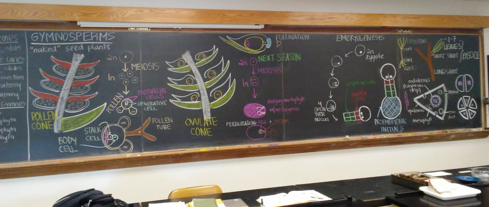
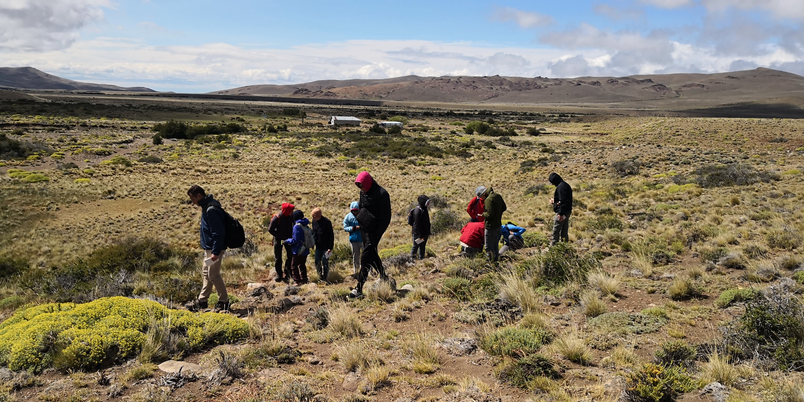

```{r setup, include=FALSE}
knitr::opts_chunk$set(echo = TRUE)
```

<br>  

<p align="center"></p>
<br clear="center"/>
<br>

#### Background

##### When I was an undergraduate student in biology at the University of California, Santa Barbara, my home was in the Native American and Indigenous Studies Program in the office of Dr. Inés Talamantez. Inés welcomed my perspective as a first-generation immigrant, the first in my family to attend college, and a woman who struggled to merge traditional Mexican culture with Western academia. As an indigenous woman, Inés taught me that like much of institutionalized American culture, our perspective of scholarship is dominated by Eurocentric ideals. The lack of representation and inclusion deters many great minds from engaging in academia, research, and higher education overall. This has largely shaped my teaching philosophy to engage students on a personal level and tailor my teaching to cultivate an inclusive and supportive setting.  

<br>



#### **Teaching Assistantships**

##### In my time as a graduate student at Cornell, I have been appointed teaching assistantships in **plant evolution and biodiversity** and **field biology** for plant science majors, and in general biology for non-majors:   

#####  + PLBIO 2300 Field Lab in Global Plant Biodiversity & Vegetation, Undergrad Course, SIPS Plant Biology Section, Cornell University. (Winter 2020)  
#####  + PLBIO 2300 Field Lab in Global Plant Biodiversity & Vegetation, Undergrad Course, SIPS Plant Biology Section, Cornell University. (Winter 2019)  
#####  + BIOG 1140 Foundations in Biology, Undergrad Course, Dept. of Neurobiology and Behavior, Cornell University. (Fall 2018)  
#####  + PLBIO 2410 Plant Biodiversity & Evolution, Undergrad Course, SIPS Plant Biology Section, Cornell University. (Fall 2017) 

<br clear="right"/>
<br>

##### As a senior undergraduate student at UCSB, I also assisted in courses focused on the intersection of religion and ecology:  
#####  + Teaching Assistant & Guest Lecturer. Native American Religious Traditions & Ecology, Undergrad Course, co-listed in Religious Studies Dept. and Environmental Studies Dept., University of California, Santa Barbara. (Summer and Fall 2011)  

<br>


#### **Natural history collections**  


Native plants of the California Channel Islands exhibit at the Pritzlaff Conservation Center, SBBG, Santa Barbara, CA, July 2016  

<br>
<p align="center"></p>
<br clear="center"/>

I reproduced historical herbarium specimens of California Channel Island native plants for an exhibit on the natural history of the Channel Islands to commemorate the opening of the Pritzlaff Conservation Center at the Santa Barbara Botanic Garden, Santa Barbara, California, July 2016. Many of these specimens were collected by renown California botanists, providing the opportunity to introduce the work of historical botanists to visitors of the exhibit and how their work is used to this day. These reproduced specimens helped illustrate to students and visitors the use of herbaria in documenting and characterizing biodiversity, and reconstructing changes in phenology, climate, biogeography, and vegetation communities.
<br>

<p align="center"></p>
<br clear="center"/>
